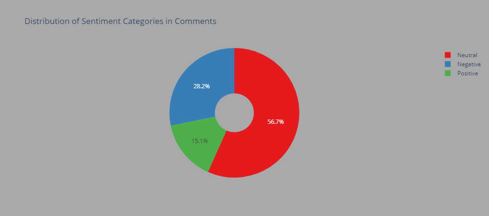
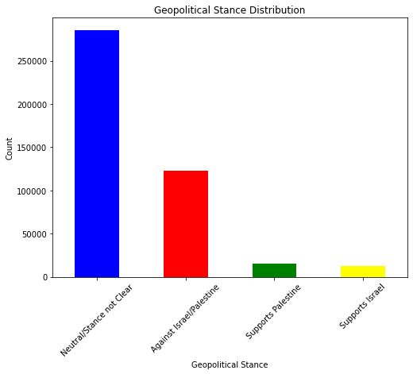

### Cell 1 - Code
```python
import pandas as pd
from sklearn.feature_extraction.text import TfidfVectorizer
from sklearn.cluster import KMeans
from nltk.corpus import stopwords
from nltk.tokenize import word_tokenize
from sklearn.decomposition import PCA
import matplotlib.pyplot as plt
import re
import numpy as np
from bs4 import BeautifulSoup
from nltk.stem import WordNetLemmatizer
from nltk.sentiment.vader import SentimentIntensityAnalyzer
import seaborn as sns
from wordcloud import WordCloud,STOPWORDS
from sklearn.decomposition import LatentDirichletAllocation
```


---

### Cell 2 - Code
```python
df=pd.read_csv(r"C:\Users\prade\Projects ML\Israel_palestine_SA\pse_isr_reddit_comments.csv\pse_isr_reddit_comments.csv")
```


---

### Cell 3 - Code
```python
df.sample(5)
```

#### Output of Cell 3
```
       comment_id  score                                          self_text  \
364253    k4d0e7j     70  &gt;As someone who supports Palestinian self-d...   
178735    k5k7jr5      4  UFC fans and little to no reading comprehensio...   
416615    k3zf3xr      6  There is no circumstance where "kill all Jews"...   
34563     k6r01b6      2  Channel 4 news is one outlet that's basically ...   
409825    k4190mh    321  Well the kid gloves are really off. Looks like...   

                 subreddit               created_time  
364253  NonCredibleDefense  2023-10-11 01:47:56+00:00  
178735  CrazyFuckingVideos  2023-10-19 16:00:19+00:00  
416615     IsraelPalestine  2023-10-08 13:08:09+00:00  
34563      IsraelPalestine  2023-10-27 23:17:57+00:00  
409825       CombatFootage  2023-10-08 19:58:05+00:00  
```

<div>
<style scoped>
    .dataframe tbody tr th:only-of-type {
        vertical-align: middle;
    }

    .dataframe tbody tr th {
        vertical-align: top;
    }

    .dataframe thead th {
        text-align: right;
    }
</style>
<table border="1" class="dataframe">
  <thead>
    <tr style="text-align: right;">
      <th></th>
      <th>comment_id</th>
      <th>score</th>
      <th>self_text</th>
      <th>subreddit</th>
      <th>created_time</th>
    </tr>
  </thead>
  <tbody>
    <tr>
      <th>364253</th>
      <td>k4d0e7j</td>
      <td>70</td>
      <td>&amp;gt;As someone who supports Palestinian self-d...</td>
      <td>NonCredibleDefense</td>
      <td>2023-10-11 01:47:56+00:00</td>
    </tr>
    <tr>
      <th>178735</th>
      <td>k5k7jr5</td>
      <td>4</td>
      <td>UFC fans and little to no reading comprehensio...</td>
      <td>CrazyFuckingVideos</td>
      <td>2023-10-19 16:00:19+00:00</td>
    </tr>
    <tr>
      <th>416615</th>
      <td>k3zf3xr</td>
      <td>6</td>
      <td>There is no circumstance where "kill all Jews"...</td>
      <td>IsraelPalestine</td>
      <td>2023-10-08 13:08:09+00:00</td>
    </tr>
    <tr>
      <th>34563</th>
      <td>k6r01b6</td>
      <td>2</td>
      <td>Channel 4 news is one outlet that's basically ...</td>
      <td>IsraelPalestine</td>
      <td>2023-10-27 23:17:57+00:00</td>
    </tr>
    <tr>
      <th>409825</th>
      <td>k4190mh</td>
      <td>321</td>
      <td>Well the kid gloves are really off. Looks like...</td>
      <td>CombatFootage</td>
      <td>2023-10-08 19:58:05+00:00</td>
    </tr>
  </tbody>
</table>
</div>


---

### Cell 4 - Code
```python
df.info
```

#### Output of Cell 4
```
<bound method DataFrame.info of        comment_id  score                                          self_text  \
0         k70vrzb      1  Lol what kind of busted translator device you ...   
1         k70vk4r      1  Translation:\n\nAmen. Kill jews and continue g...   
2         k70vhew      1  Friendly fact reminder: Israel has been steali...   
3         k70ve4h      1  Well, i would never support Hamas, but there a...   
4         k70vay1      1  /u/TickeMeTendie. This is an automatic notice:...   
...           ...    ...                                                ...   
436720    k3sdwfc     42                               US. This is bullshit   
436721    k3sdixt      1  I am in the United States and it has the dotte...   
436722    k3sccp2     54  In which country are you?\nSometimes maps adap...   
436723    k3ritvj    116  You can't give up on something you only preten...   
436724    k3riboh     30  &gt; The head of Islamic Jihad denounced Arab ...   

              subreddit               created_time  
0       IsraelPalestine  2023-10-29 23:59:03+00:00  
1       IsraelPalestine  2023-10-29 23:57:29+00:00  
2       IsraelPalestine  2023-10-29 23:56:58+00:00  
3       IsraelPalestine  2023-10-29 23:56:18+00:00  
4       IsraelPalestine  2023-10-29 23:55:42+00:00  
...                 ...                        ...  
436720        Palestine  2023-10-06 23:50:11+00:00  
436721        Palestine  2023-10-06 23:47:23+00:00  
436722        Palestine  2023-10-06 23:38:26+00:00  
436723        worldnews  2023-10-06 20:16:05+00:00  
436724        worldnews  2023-10-06 20:12:58+00:00  

[436725 rows x 5 columns]>
```


---

### Cell 5 - Code
```python
for i in range(10):
    print(df.self_text[i])
```

#### Output of Cell 5
```
Lol what kind of busted translator device you got. Does it speak only hasbara?
Translation:

Amen. Kill jews and continue gazan oppression!
Friendly fact reminder: Israel has been stealing Palestines land, bombing their civilians, controlling their access to water/food and kidnapping Palestinian civilians for over 50 years. Israel has  been committing genocide on Palestine but somehow people like you like to place the blame on Palestine. If you think Hamas is bad, I have some bad news about the IDF for you.
Well, i would never support Hamas, but there actions Israel could do that would make me stop supporting it: State orginized killing of Israeli or west bank Arabs or use of Atomic weaponary.
/u/TickeMeTendie. This is an automatic notice: 
'Nazis' Casual comments and analogies are inflammatory and therefor not allowed.  
We allow for exemptions for comments with meaningful information that must be based on historical facts accepted by mainstream historians. See [Rule 6](https://www.reddit.com/r/IsraelPalestine/wiki/rules/detailed-rules#wiki_6._nazi_comparisons) for details.  
This bot flags comments using simple word detection, and cannot distinguish between acceptable and unacceptable usage. Please take a moment to review your comment to confirm that it is in compliance.


*I am a bot, and this action was performed automatically. Please [contact the moderators of this subreddit](/message/compose/?to=/r/IsraelPalestine) if you have any questions or concerns.*
There is absolutely evidence of Hamas taking Captagon - a drug similar to Pervitin, which the Nazis took - and it’s been reported by multiple outlets. 

https://www.businessinsider.com/hamas-militants-high-poor-mans-cocaine-oct-7-attacks-report-2023-10?amp

https://nypost.com/2023/10/23/hamas-terrorists-were-high-on-poor-mans-cocaine-report/amp/
Do you have the avtual link to the new york times? Because I looked at it and they said hamas didnt give them any evidance. All of of this is just lies
I didn't deny anything you said.

I said Israel doesn't use human shields and Gaza does. Which is a fact.

You chose to change the subject to Israel having locals in Gaza deliver messages for them years ago. The behavior you're complaining about ceased.

So what was the point of bringing it up when I said Israel doesn't use human shields and Gaza does? Just as a distraction?
&gt;Yes, exactly, Hamas attacked, not the 1 million kids in Gaza. No amount of capslock or invoking of October 7th is gonna make murdering kids ok

Which makes all of that Hamas's fault.  EVERY death since October 7th, by bullet, bomb, every single kid who dies, is Hamas's fault.

That's why in the United States if you're part of a 3 person bank robbery, every person who dies is a murder that is on your hands.  Even the 2 other people who are with you, if they get shot by a security guard, that's a murder charge for you, because you're the one responsible for everything that happened as a result of you taking a gun into a bank to commit a robbery.

The safety of every child in Gaza was Hama's responsibility, and they willingly put all of those lives in jeopardy when they attacked Israel.  So spare us all the equivocation and acting like all of this is suddenly some evil that the Israeli's are perpetrating on the innocents of Gaza ... Hamas could stop all of this at any moment if they wanted to, all they'd have to do is lay down their weapons, release their hostages, and surrender to be judged for their crimes on October 7th.

If you want to complain about the innocent lives being lost in Gaza, complain to Hamas, because every death that has occurred in battle since October 7th has been Hamas's fault.
Firstly, even in the best scenario you are confusing "Gazans" with "Palestinians", which is particularly disgusting since Israelis are doing unjustifiable attacks on West Bank Palestinians right now.

Secondly, even if we knew that 99% of Gazans support Hamas, it would still be bad to think in this way, because it does not allow for even the possibility of peace without ethnic cleansing.

```


---

### Cell 6 - Code
```python
import zipfile
import os

zip_file_path = 'C:\\Users\\prade\\AppData\\Roaming\\nltk_data\\corpora\\wordnet.zip'
destination_directory = 'C:\\Users\\prade\\AppData\\Roaming\\nltk_data\\corpora'

# Check if the specific file exists in the destination directory
file_to_check = 'index.adv'
file_path_to_check = os.path.join(destination_directory, 'wordnet', file_to_check)

if not os.path.exists(file_path_to_check):
    # Unzip the entire archive if the specific file doesn't exist
    with zipfile.ZipFile(zip_file_path, 'r') as zip_ref:
        zip_ref.extractall(destination_directory)
    print(f"Successfully unzipped {zip_file_path} to {destination_directory}")
else:
    print(f"File {file_to_check} already exists. No need to unzip the archive.")
```

#### Output of Cell 6
```
File index.adv already exists. No need to unzip the archive.

```


---

### Cell 7 - Code
```python
lemmatizer=WordNetLemmatizer()
stop_words=set(stopwords.words('english'))

def clean_text(text):
    text=re.sub(r'http\S+', '',text)

    soup=BeautifulSoup(text, 'html.parser')
    text=soup.get_text()

    text=re.sub(r'[^a-zA-Z0-9\s]', '',text).lower()

    tokens=word_tokenize(text)

    tokens=[lemmatizer.lemmatize(token) for token in tokens if token not in stop_words]

    cleaned_text=' '.join(tokens)

    return cleaned_text

df['clean_text']=df['self_text'].apply(clean_text)


```

#### Output of Cell 7
```
c:\Users\prade\anaconda3\lib\site-packages\bs4\__init__.py:435: MarkupResemblesLocatorWarning: The input looks more like a filename than markup. You may want to open this file and pass the filehandle into Beautiful Soup.
  warnings.warn(

```


---

### Cell 8 - Code
```python
for i in range(10):
    print(df.clean_text[i])
```

#### Output of Cell 8
```
lol kind busted translator device got speak hasbara
translation amen kill jew continue gazan oppression
friendly fact reminder israel stealing palestine land bombing civilian controlling access waterfood kidnapping palestinian civilian 50 year israel committing genocide palestine somehow people like like place blame palestine think hamas bad bad news idf
well would never support hamas action israel could would make stop supporting state orginized killing israeli west bank arab use atomic weaponary
utickemetendie automatic notice nazi casual comment analogy inflammatory therefor allowed allow exemption comment meaningful information must based historical fact accepted mainstream historian see rule 6 detail bot flag comment using simple word detection distinguish acceptable unacceptable usage please take moment review comment confirm compliance bot action performed automatically please contact moderator subredditmessagecomposetorisraelpalestine question concern
absolutely evidence hamas taking captagon drug similar pervitin nazi took reported multiple outlet
avtual link new york time looked said hamas didnt give evidance lie
didnt deny anything said said israel doesnt use human shield gaza fact chose change subject israel local gaza deliver message year ago behavior youre complaining ceased point bringing said israel doesnt use human shield gaza distraction
yes exactly hamas attacked 1 million kid gaza amount capslock invoking october 7th gon na make murdering kid ok make hamas fault every death since october 7th bullet bomb every single kid dy hamas fault thats united state youre part 3 person bank robbery every person dy murder hand even 2 people get shot security guard thats murder charge youre one responsible everything happened result taking gun bank commit robbery safety every child gaza hamas responsibility willingly put life jeopardy attacked israel spare u equivocation acting like suddenly evil israeli perpetrating innocent gaza hamas could stop moment wanted theyd lay weapon release hostage surrender judged crime october 7th want complain innocent life lost gaza complain hamas every death occurred battle since october 7th hamas fault
firstly even best scenario confusing gazans palestinian particularly disgusting since israeli unjustifiable attack west bank palestinian right secondly even knew 99 gazans support hamas would still bad think way allow even possibility peace without ethnic cleansing

```


---

### Cell 9 - Code
```python
df.info()
```

#### Output of Cell 9
```
<class 'pandas.core.frame.DataFrame'>
RangeIndex: 436725 entries, 0 to 436724
Data columns (total 6 columns):
 #   Column        Non-Null Count   Dtype 
---  ------        --------------   ----- 
 0   comment_id    436725 non-null  object
 1   score         436725 non-null  int64 
 2   self_text     436725 non-null  object
 3   subreddit     436725 non-null  object
 4   created_time  436725 non-null  object
 5   clean_text    436725 non-null  object
dtypes: int64(1), object(5)
memory usage: 20.0+ MB

```


---

### Cell 10 - Markdown
SENTIMENT ANALYSIS USING VADER


---

### Cell 11 - Code
```python

analyzer=SentimentIntensityAnalyzer()

scores={
    "Compound":[],
    "Positive":[],
    "Negative":[],
    "Neutral":[]
}

#generating sentiment scores for reddit Comments

for comment in df['clean_text']:
    compound=analyzer.polarity_scores(comment)["compound"]
    pos=analyzer.polarity_scores(comment)["pos"]
    neu=analyzer.polarity_scores(comment)["neu"]
    neg=analyzer.polarity_scores(comment)["neg"]

    scores["Compound"].append(compound)
    scores["Positive"].append(pos)
    scores["Negative"].append(neg)
    scores["Neutral"].append(neu)

#creating new Dataframe for sentiment scores
sentiment_score=pd.DataFrame(scores)

#joining scores dataframe with original dataframe

df=pd.concat([df,sentiment_score],axis=1)
```


---

### Cell 12 - Code
```python
df.head()
```

#### Output of Cell 12
```
  comment_id  score                                          self_text  \
0    k70vrzb      1  Lol what kind of busted translator device you ...   
1    k70vk4r      1  Translation:\n\nAmen. Kill jews and continue g...   
2    k70vhew      1  Friendly fact reminder: Israel has been steali...   
3    k70ve4h      1  Well, i would never support Hamas, but there a...   
4    k70vay1      1  /u/TickeMeTendie. This is an automatic notice:...   

         subreddit               created_time  \
0  IsraelPalestine  2023-10-29 23:59:03+00:00   
1  IsraelPalestine  2023-10-29 23:57:29+00:00   
2  IsraelPalestine  2023-10-29 23:56:58+00:00   
3  IsraelPalestine  2023-10-29 23:56:18+00:00   
4  IsraelPalestine  2023-10-29 23:55:42+00:00   

                                          clean_text  Compound  Positive  \
0  lol kind busted translator device got speak ha...    0.7351     0.508   
1  translation amen kill jew continue gazan oppre...   -0.6908     0.000   
2  friendly fact reminder israel stealing palesti...   -0.6808     0.195   
3  well would never support hamas action israel c...   -0.5938     0.162   
4  utickemetendie automatic notice nazi casual co...    0.8402     0.238   

   Negative  Neutral  
0     0.000    0.492  
1     0.439    0.561  
2     0.270    0.535  
3     0.287    0.551  
4     0.048    0.714  
```

<div>
<style scoped>
    .dataframe tbody tr th:only-of-type {
        vertical-align: middle;
    }

    .dataframe tbody tr th {
        vertical-align: top;
    }

    .dataframe thead th {
        text-align: right;
    }
</style>
<table border="1" class="dataframe">
  <thead>
    <tr style="text-align: right;">
      <th></th>
      <th>comment_id</th>
      <th>score</th>
      <th>self_text</th>
      <th>subreddit</th>
      <th>created_time</th>
      <th>clean_text</th>
      <th>Compound</th>
      <th>Positive</th>
      <th>Negative</th>
      <th>Neutral</th>
    </tr>
  </thead>
  <tbody>
    <tr>
      <th>0</th>
      <td>k70vrzb</td>
      <td>1</td>
      <td>Lol what kind of busted translator device you ...</td>
      <td>IsraelPalestine</td>
      <td>2023-10-29 23:59:03+00:00</td>
      <td>lol kind busted translator device got speak ha...</td>
      <td>0.7351</td>
      <td>0.508</td>
      <td>0.000</td>
      <td>0.492</td>
    </tr>
    <tr>
      <th>1</th>
      <td>k70vk4r</td>
      <td>1</td>
      <td>Translation:\n\nAmen. Kill jews and continue g...</td>
      <td>IsraelPalestine</td>
      <td>2023-10-29 23:57:29+00:00</td>
      <td>translation amen kill jew continue gazan oppre...</td>
      <td>-0.6908</td>
      <td>0.000</td>
      <td>0.439</td>
      <td>0.561</td>
    </tr>
    <tr>
      <th>2</th>
      <td>k70vhew</td>
      <td>1</td>
      <td>Friendly fact reminder: Israel has been steali...</td>
      <td>IsraelPalestine</td>
      <td>2023-10-29 23:56:58+00:00</td>
      <td>friendly fact reminder israel stealing palesti...</td>
      <td>-0.6808</td>
      <td>0.195</td>
      <td>0.270</td>
      <td>0.535</td>
    </tr>
    <tr>
      <th>3</th>
      <td>k70ve4h</td>
      <td>1</td>
      <td>Well, i would never support Hamas, but there a...</td>
      <td>IsraelPalestine</td>
      <td>2023-10-29 23:56:18+00:00</td>
      <td>well would never support hamas action israel c...</td>
      <td>-0.5938</td>
      <td>0.162</td>
      <td>0.287</td>
      <td>0.551</td>
    </tr>
    <tr>
      <th>4</th>
      <td>k70vay1</td>
      <td>1</td>
      <td>/u/TickeMeTendie. This is an automatic notice:...</td>
      <td>IsraelPalestine</td>
      <td>2023-10-29 23:55:42+00:00</td>
      <td>utickemetendie automatic notice nazi casual co...</td>
      <td>0.8402</td>
      <td>0.238</td>
      <td>0.048</td>
      <td>0.714</td>
    </tr>
  </tbody>
</table>
</div>


---

### Cell 13 - Code
```python
#defining conditions for sentiment categories based on 'compound' scores

#if comp score <=-0.5 classify as "negative"
#if comp score >-0.5 and <0.5 classify as "neutral"
#if comp score >=0.5 classify as "positive"

conditons=[
    (df['Compound']<= -0.5),
    (df['Compound']> -0.5) & (df['Compound']< 0.5),
    (df['Compound']> 0.5)
]

#defining corresponding values for eaach condition

values=['Negative','Neutral','Positive']

#creating new column 'Category' to assign values based on conditions
df['Category']=np.select(conditons,values)
```


---

### Cell 14 - Code
```python
df.head()
```

#### Output of Cell 14
```
  comment_id  score                                          self_text  \
0    k70vrzb      1  Lol what kind of busted translator device you ...   
1    k70vk4r      1  Translation:\n\nAmen. Kill jews and continue g...   
2    k70vhew      1  Friendly fact reminder: Israel has been steali...   
3    k70ve4h      1  Well, i would never support Hamas, but there a...   
4    k70vay1      1  /u/TickeMeTendie. This is an automatic notice:...   

         subreddit               created_time  \
0  IsraelPalestine  2023-10-29 23:59:03+00:00   
1  IsraelPalestine  2023-10-29 23:57:29+00:00   
2  IsraelPalestine  2023-10-29 23:56:58+00:00   
3  IsraelPalestine  2023-10-29 23:56:18+00:00   
4  IsraelPalestine  2023-10-29 23:55:42+00:00   

                                          clean_text  Compound  Positive  \
0  lol kind busted translator device got speak ha...    0.7351     0.508   
1  translation amen kill jew continue gazan oppre...   -0.6908     0.000   
2  friendly fact reminder israel stealing palesti...   -0.6808     0.195   
3  well would never support hamas action israel c...   -0.5938     0.162   
4  utickemetendie automatic notice nazi casual co...    0.8402     0.238   

   Negative  Neutral  Category  
0     0.000    0.492  Positive  
1     0.439    0.561  Negative  
2     0.270    0.535  Negative  
3     0.287    0.551  Negative  
4     0.048    0.714  Positive  
```

<div>
<style scoped>
    .dataframe tbody tr th:only-of-type {
        vertical-align: middle;
    }

    .dataframe tbody tr th {
        vertical-align: top;
    }

    .dataframe thead th {
        text-align: right;
    }
</style>
<table border="1" class="dataframe">
  <thead>
    <tr style="text-align: right;">
      <th></th>
      <th>comment_id</th>
      <th>score</th>
      <th>self_text</th>
      <th>subreddit</th>
      <th>created_time</th>
      <th>clean_text</th>
      <th>Compound</th>
      <th>Positive</th>
      <th>Negative</th>
      <th>Neutral</th>
      <th>Category</th>
    </tr>
  </thead>
  <tbody>
    <tr>
      <th>0</th>
      <td>k70vrzb</td>
      <td>1</td>
      <td>Lol what kind of busted translator device you ...</td>
      <td>IsraelPalestine</td>
      <td>2023-10-29 23:59:03+00:00</td>
      <td>lol kind busted translator device got speak ha...</td>
      <td>0.7351</td>
      <td>0.508</td>
      <td>0.000</td>
      <td>0.492</td>
      <td>Positive</td>
    </tr>
    <tr>
      <th>1</th>
      <td>k70vk4r</td>
      <td>1</td>
      <td>Translation:\n\nAmen. Kill jews and continue g...</td>
      <td>IsraelPalestine</td>
      <td>2023-10-29 23:57:29+00:00</td>
      <td>translation amen kill jew continue gazan oppre...</td>
      <td>-0.6908</td>
      <td>0.000</td>
      <td>0.439</td>
      <td>0.561</td>
      <td>Negative</td>
    </tr>
    <tr>
      <th>2</th>
      <td>k70vhew</td>
      <td>1</td>
      <td>Friendly fact reminder: Israel has been steali...</td>
      <td>IsraelPalestine</td>
      <td>2023-10-29 23:56:58+00:00</td>
      <td>friendly fact reminder israel stealing palesti...</td>
      <td>-0.6808</td>
      <td>0.195</td>
      <td>0.270</td>
      <td>0.535</td>
      <td>Negative</td>
    </tr>
    <tr>
      <th>3</th>
      <td>k70ve4h</td>
      <td>1</td>
      <td>Well, i would never support Hamas, but there a...</td>
      <td>IsraelPalestine</td>
      <td>2023-10-29 23:56:18+00:00</td>
      <td>well would never support hamas action israel c...</td>
      <td>-0.5938</td>
      <td>0.162</td>
      <td>0.287</td>
      <td>0.551</td>
      <td>Negative</td>
    </tr>
    <tr>
      <th>4</th>
      <td>k70vay1</td>
      <td>1</td>
      <td>/u/TickeMeTendie. This is an automatic notice:...</td>
      <td>IsraelPalestine</td>
      <td>2023-10-29 23:55:42+00:00</td>
      <td>utickemetendie automatic notice nazi casual co...</td>
      <td>0.8402</td>
      <td>0.238</td>
      <td>0.048</td>
      <td>0.714</td>
      <td>Positive</td>
    </tr>
  </tbody>
</table>
</div>


---

### Cell 15 - Markdown
EXPLORATORY DATA ANALYSIS


---

### Cell 16 - Code
```python
#grouping dataframe by catgory and counting occurences of each category

category_counts=df.groupby(['Category'])['Category'].count()

#creating dataframe with counts and renaming column to 'counts'ArithmeticError
counts_df=pd.DataFrame(category_counts).rename(columns={"Category":"Counts"})

#calculating percentag for each category and add it as a new column 'percentage'
counts_df['Percentage']=(counts_df['Counts']/counts_df['Counts'].sum())*100

counts_df=counts_df.drop(index='0')

#returning summary Dataframe
print(counts_df)
```

#### Output of Cell 16
```
          Counts  Percentage
Category                    
Negative  123092   28.185242
Neutral   247471   56.665178
Positive   66146   15.145916

```


---

### Cell 17 - Code
```python
counts_df
```

#### Output of Cell 17
```
          Counts  Percentage
Category                    
Negative  123092   28.185242
Neutral   247471   56.665178
Positive   66146   15.145916
```

<div>
<style scoped>
    .dataframe tbody tr th:only-of-type {
        vertical-align: middle;
    }

    .dataframe tbody tr th {
        vertical-align: top;
    }

    .dataframe thead th {
        text-align: right;
    }
</style>
<table border="1" class="dataframe">
  <thead>
    <tr style="text-align: right;">
      <th></th>
      <th>Counts</th>
      <th>Percentage</th>
    </tr>
    <tr>
      <th>Category</th>
      <th></th>
      <th></th>
    </tr>
  </thead>
  <tbody>
    <tr>
      <th>Negative</th>
      <td>123092</td>
      <td>28.185242</td>
    </tr>
    <tr>
      <th>Neutral</th>
      <td>247471</td>
      <td>56.665178</td>
    </tr>
    <tr>
      <th>Positive</th>
      <td>66146</td>
      <td>15.145916</td>
    </tr>
  </tbody>
</table>
</div>


---

### Cell 18 - Markdown
PIE CHART OF SENTIMENT COUNTS


---

### Cell 19 - Code
```python
import plotly.express as px

#creating piechart using plotly
fig=px.pie(counts_df,values='Counts',names=counts_df.index,
           labels={'Category':'Sentiment Category','Counts':'Count'},
           title='Distribution of Sentiment Categories in Comments',
           hole=0.3,color_discrete_sequence=px.colors.qualitative.Set1)

#setting bg of chart
fig.update_layout(paper_bgcolor='darkgrey')

fig.show()

```

#### Output of Cell 19

---

### Cell 20 - Markdown



---

### Cell 21 - Markdown
POSITIVE OR NEGATIVE BIAS DETECTION


---

### Cell 22 - Code
```python
subreddit_sentiment=df.groupby('subreddit')[['Positive','Negative']].mean()
#calculating difference between positive and negative sentiment scores
subreddit_sentiment['Bias']=subreddit_sentiment['Positive']-subreddit_sentiment['Negative']

#determining direction of bias:positive,negative or neutral
def determine_bias(bias):
    if bias>0.01:
        return 'Positive'
    elif bias< -0.01:
        return 'Negative'
    else:
        return 'Neutral'

subreddit_sentiment['Bias Direction']=subreddit_sentiment['Bias'].apply(determine_bias)

most_biased_subreddits=subreddit_sentiment.sort_values(by='Bias',ascending=False)
print(most_biased_subreddits)
```

#### Output of Cell 22
```
                       Positive  Negative      Bias Bias Direction
subreddit                                                         
AbruptChaos            0.170791  0.132264  0.038527       Positive
NonCredibleDefense     0.155961  0.147808  0.008152        Neutral
CrazyFuckingVideos     0.162982  0.168266 -0.005284        Neutral
Palestine              0.176340  0.186609 -0.010269       Negative
AskMiddleEast          0.166732  0.182092 -0.015360       Negative
IsraelPalestine        0.166904  0.186300 -0.019397       Negative
CombatFootage          0.157813  0.182511 -0.024698       Negative
worldnews              0.160626  0.186105 -0.025479       Negative
ActualPublicFreakouts  0.177926  0.206657 -0.028731       Negative
worldnewsvideo         0.172257  0.205349 -0.033092       Negative
TerrifyingAsFuck       0.167938  0.203776 -0.035839       Negative
PublicFreakout         0.160095  0.202689 -0.042594       Negative
IsrealPalestineWar_23  0.171626  0.220825 -0.049199       Negative
NoahGetTheBoat         0.171286  0.241434 -0.070148       Negative

```


---

### Cell 23 - Markdown
TOPIC MODELLING


---

### Cell 24 - Code
```python
vectorizer=TfidfVectorizer(max_features=5000,stop_words='english')
tfidf_matrix=vectorizer.fit_transform(df['clean_text'])
lda_model=LatentDirichletAllocation(n_components=5,random_state=42,n_jobs=-1)
#assuming 5 topics
lda_topic_matrix=lda_model.fit_transform(tfidf_matrix)

```


---

### Cell 25 - Code
```python
#getting feature names from vectorizer
feature_names=vectorizer.get_feature_names_out()

#getting top words for each topic
n_top_words=15
top_wordsper_topic=[]
for topic_idx,topic in enumerate(lda_model.components_):
    topic_words_idx=topic.argsort()[:-n_top_words-1:-1]
    top_words=[feature_names[i] for i in topic_words_idx]
    top_wordsper_topic.append(top_words)

#displaying topics and associated top words
for topic_idx,top_words in enumerate(top_wordsper_topic):
    print(f"Topic #{topic_idx+1}: ")
    print(", ".join(top_words))
    print("\n")
    
```

#### Output of Cell 25
```
Topic #1: 
hamas, palestinian, israel, people, israeli, terrorist, civilian, child, dont, palestine, support, right, genocide, war, like


Topic #2: 
israel, land, arab, year, country, like, war, yes, time, palestinian, jew, iran, people, state, palestine


Topic #3: 
israel, hamas, gaza, civilian, war, rocket, egypt, people, dont, palestinian, water, bomb, want, military, like


Topic #4: 
jew, dont, people, muslim, comment, im, know, israel, like, think, thank, religion, say, youre, jewish


Topic #5: 
video, source, like, lol, news, hospital, post, hamas, thats, look, im, evidence, know, propaganda, people


```


---

### Cell 26 - Code
```python
#getting vocbulary indices for 'israel' and 'palestine' in vectorizer

israel_word_index=vectorizer.vocabulary_['israel']
palestine_word_index=vectorizer.vocabulary_['palestine']

topic_term_distribution=lda_model.components_

israel_topic_index=topic_term_distribution[:, israel_word_index].argmax()
palestine_topic_index=topic_term_distribution[:, palestine_word_index].argmax()
```


---

### Cell 27 - Markdown
GEOPOLITICAL STANCE DETERMINATION USING DOMINNT TOPICS AND SENTIMENT SCORES.


---

### Cell 28 - Code
```python
#function to determine geopolitical stance
def determine_geopolitical_stance(row):
    sentiment_score=row['Compound']
    topic_distribution=lda_model.transform(vectorizer.transform([row['clean_text']]))[0]

    #determining stance based on sentiment score and dominant topic
    if sentiment_score<= -0.5:
        return "Against Israel/Palestine"
    elif sentiment_score >= 0.5 and topic_distribution.argmax()==israel_topic_index:
        return "Supports Israel"
    elif sentiment_score >= 0.5 and topic_distribution.argmax()==palestine_topic_index:
        return "Supports Palestine"
    else:
        return "Neutral/Stance not Clear"
    
#applying function to dataframe to understand geopolitical stance

df['geopolitical_stance']=df.apply(determine_geopolitical_stance,axis=1)
```


---

### Cell 29 - Code
```python
stance_counts=df['geopolitical_stance'].value_counts()
print("Geopolitical Stance Distribution: ")
print(stance_counts)
```

#### Output of Cell 29
```
Geopolitical Stance Distribution: 
Neutral/Stance not Clear    285629
Against Israel/Palestine    123092
Supports Palestine           15117
Supports Israel              12887
Name: geopolitical_stance, dtype: int64

```


---

### Cell 30 - Code
```python
stance_counts=df['geopolitical_stance'].value_counts()

#creating bar chart using dataframe values
plt.figure(figsize=(8,6))
stance_counts.plot(kind='bar',color=['blue','red','green','yellow'])
plt.xlabel('Geopolitical Stance')
plt.ylabel('Count')
plt.title('Geopolitical Stance Distribution')
plt.xticks(rotation=45)
plt.show()
```

#### Output of Cell 30
```
<Figure size 576x432 with 1 Axes>
```




---

### Cell 31 - Markdown
The distribution of geopolitical stances on the Israel-Palestine issue within the dataset is as follows:

Neutral/Stance Not Clear: This category comprises the majority with 286,000 instances, indicating that a significant portion of the data does not express a clear position on the Israel-Palestine issue.

Against Israel/Palestine: There are 123,092 instances where the stance opposes Israel, Palestine, or both. This reflects a substantial segment of the dataset expressing negative sentiment or opposition towards the parties involved.

Supports Palestine: There are 13,911 instances where the stance supports Palestine. While fewer in number compared to neutrality and opposition, this segment represents a notable portion of the dataset that favors the Palestinian side.

Supports Israel: There are 13,722 instances where the stance supports Israel. Similar to supporting Palestine, this segment is smaller but significant within the dataset, indicating support for the Israeli side.

INFERENCE:

Neutral/Stance Not Clear: The largest group, indicating that most of the dataset does not take a definitive stance on the Israel-Palestine issue.


Against Israel/Palestine: A substantial number of instances express opposition or negative sentiment towards Israel, Palestine, or both.


Supports Palestine: Represents a smaller but notable segment supporting the Palestinian side.


Supports Israel: Also a smaller but significant segment expressing support for the Israeli side.


This breakdown underscores the diversity of opinions within the dataset regarding the Israel-Palestine conflict, with a significant portion not clearly stating a stance, and a slightly higher number leaning towards opposition compared to support for either side.


---

